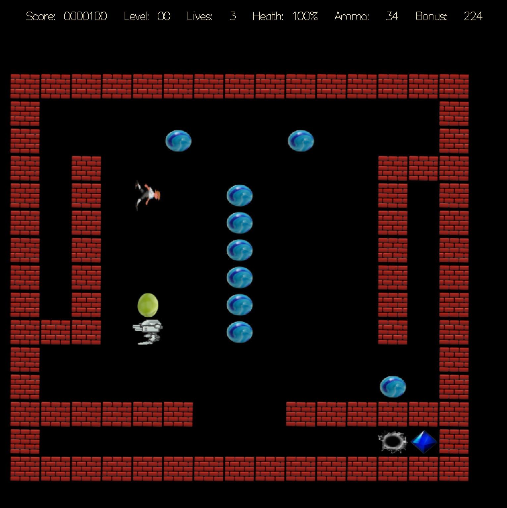
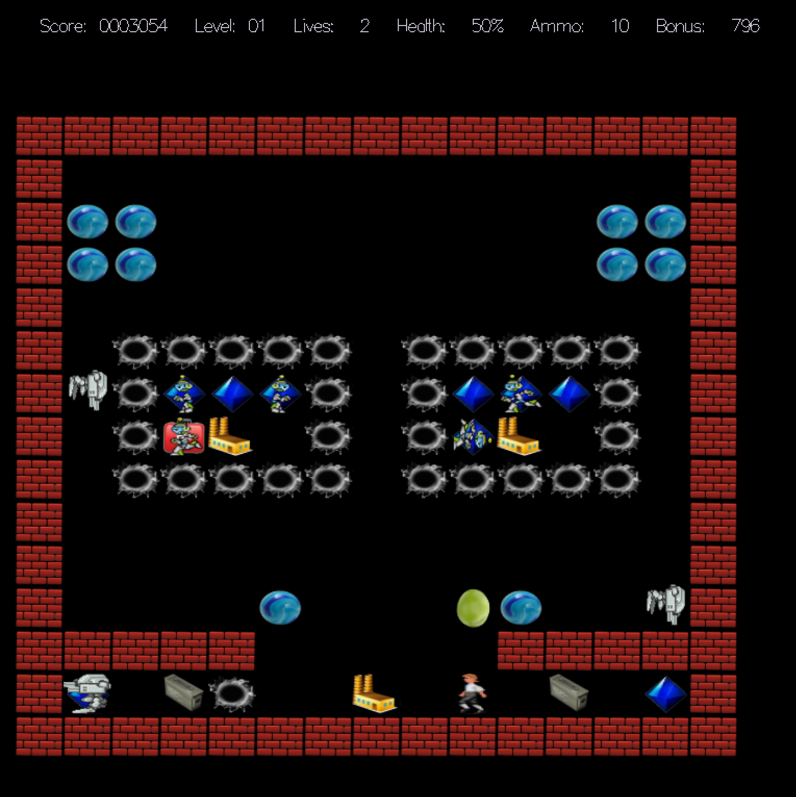
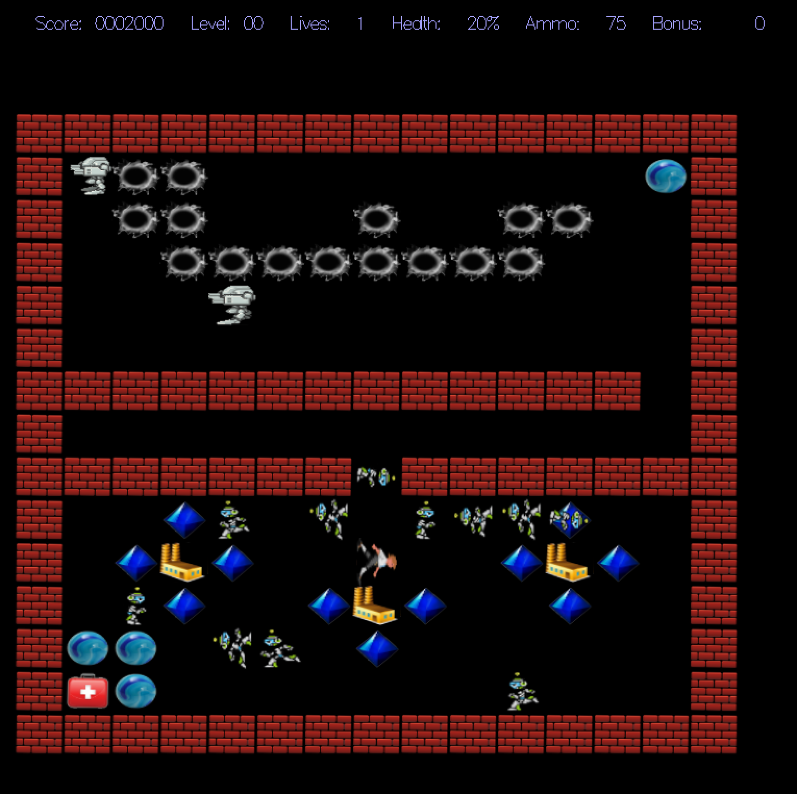
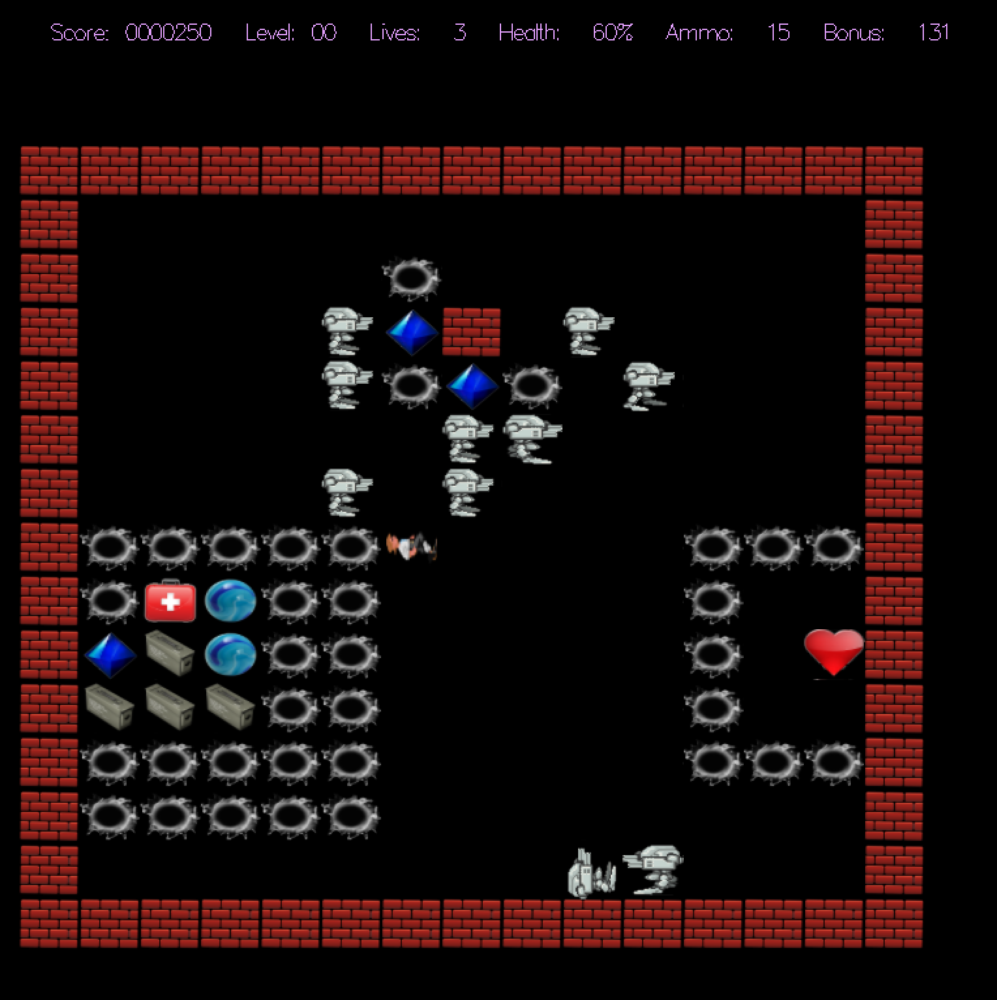

# Marble Madness
Marble Madness is a 2D interactive video game designed with C++, OpenGL, and GLUT. Navigate the mazes, gather the crystals, and avoid the deadly robots to win and escape!

## Prerequisites - XQuartz (macOS)
1. **Homebrew**: If you don't have Homebrew installed, you can install it by running the following command in your terminal:
    ```bash
    /bin/bash -c "$(curl -fsSL https://raw.githubusercontent.com/Homebrew/install/HEAD/install.sh)"
    ```
2. **XQuartz**: XQuartz is required for OpenGL and GLUT on macOS. Install it by running:
    ```bash
    brew install --cask xquartz
    ```
3. After installing XQuartz, you may need to restart your computer. To verify installation, run the command ```echo $DISPLAY``` in your terminal. The output of this command should end with ```org.xquartz:0```.
4. **CMake**: If you want to build with CMake, install it by running:
    ```bash
    brew install cmake
    ```

## Gameplay Images




